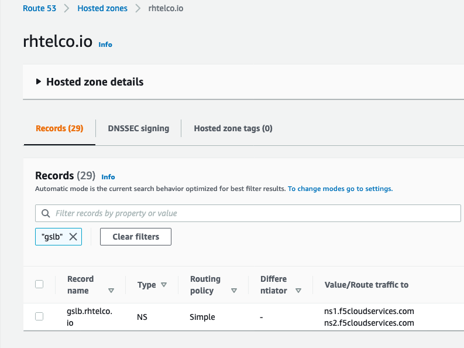

## Motivation
This document was put together to help a complete beginner. This will be an opinionated step-wise guide to recreate the ACM + Ansible demo.

## Caveat
I've only tested this with multiple AWS regions.

## Pre-Reqs

1. ACM is installed on a beefy OCP cluster. See the [install_config](https://github.com/mdelder/k8s-pacman-app#install-configyaml) provided in the main README file. I found that if you also have cluster monitoring enabled, you will need 5 workers (total of 8 m5.xlarge nodes) for installing tower on the hub cluster.

2. **Create a developer instance of ServiceNow.** If you need a developer instance of ServiceNow, follow the directions at https://developer.servicenow.com/.

3. **Create an account with the F5 Cloud DNS Load Balancer service.** If you need to create an account with F5 Cloud DNS Load Balancer SaaS, you can do this through the [AWS Marketplace](https://aws.amazon.com/marketplace/pp/F5-Networks-F5-DNS-Load-Balancer-Cloud-Service/B07W3P8HM4).

4. Have registered and have a DNS domain available through Route53.

## Steps to recreate

### Install Ansible Tower on OCP

1. Apply the policies under `hack/manifests/policies`.

  ```bash
  cd hack/manifests
  oc apply -f ansible-tower-policies-subscription.yaml
  ```

  The result of these policies will setup the (a) Ansible Resource Operator, (b) prepare the Ansible Tower `Project` named `tower` and (c) create a `PeristentVolumeClaim` using the default storage class to support Ansible Tower's database (PostgresSQL).

  After a few moments, verify the resources were correctly applied on your Hub cluster. You can view the Policies `policy-ansible-tower-prep` and `policy-auth-provider` are Compliant from your RHACM web console (under "Govern Risk"). You can also verify the resources that were created as follows:

#TODO: Update this output

  ```bash
  oc get subs.operators --all-namespaces
  NAMESPACE                 NAME                        PACKAGE                       SOURCE                CHANNEL
  open-cluster-management   acm-operator-subscription   advanced-cluster-management   acm-custom-registry   release-2.1
  tower-resource-operator   awx-resource-operator       awx-resource-operator         redhat-operators      release-0.1

  oc get pvc -n tower
  NAME         STATUS   VOLUME                                     CAPACITY   ACCESS MODES   STORAGECLASS   AGE
  postgresql   Bound    pvc-1554a179-0947-4a65-9af0-81c5f2d8b476   5Gi        RWO            gp2            3d20h
```

>Note: The PVC will be unbound until the tower pod is created in the following steps below

2. Download the Tower-on-OCP installation tarball: [Tower3.7.2](https://releases.ansible.com/ansible-tower/setup_openshift/ansible-tower-openshift-setup-3.7.2-1.tar.gz) on your laptop. Make sure you are using 3.7.x and not 3.8 due to Python version dependencies used by the task container.

3. Untar this file and update the inventory file as specified in the main README file. Specifically be sure to override:

    1. `SPECIFY_YOUR_OWN_PASSWORD`: Choose a strong password of at least 16 characters.
    2. `SPECIFY_YOUR_CLUSTER_ADDRESS`: Provide the correct hostname of the API server for your OpenShift cluster.
    3. `SPECIFY_YOUR_OPENSHIFT_CREDENTIALS`: The password for your OpenShift cluster admin user. Be sure to also override `kubeadmin` if you have defined an alternate administrative user.

4. **IMPORTANT**: Update the `oc` command in `roles/kubernetes/vars/openshift.yml` from `openshift_oc_bin: "oc --config={{ openshift_oc_config_file }}"` to `openshift_oc_bin: "oc --kubeconfig={{ openshift_oc_config_file }}"`

5. **IMPORTANT**: Update the default task image that is used to run the defined Jobs. Because the Jobs use additional modules, we need to ensure that various python module dependencies are available.

    In `group_vars/all`, update the following key:
    ```yaml
    kubernetes_task_image: quay.io/mdelder/ansible-tower-task
   ```

Follow the remaining steps for Tower from the main README file (Repeated below for convenience):

6. Run the installer.

    ```bash
    ./setup_openshift.sh
    ```

7. Launch the Tower web console.

    ```bash
    open https://$(oc get route -n tower ansible-tower-web-svc -ojsonpath='{.status.ingress[0].host}')
    ```

    Login with the user and password that you specified in the `inventory` file above. You must then choose your license for Tower. If you have a Red Hat user identity, you can login and choose the 60-day evaluation license.

8. Optionally, cusomtize the `hack/manifests/ansible-tower-console-link.yaml` for your own cluster. Then apply the file (NOTE: You must update the URL within the file before this will work in your cluster).

    ```bash
    cd hack/manifests
    oc apply ansible-tower-console-link.yaml
    ```

    After applying the `ConsoleLink`, refresh your OpenShift web console and view the shortcut to your Ansible Tower under the "Applications" drop down in the header.


### Set up the F5 Global DNS Load Balancing service:

1. On your AWS Route53 domain(Hosted Zone), create a NS record. Example: If your hosted zone is rhtelco.io, create a record called gslb.rhtelco.io. Create it as a NS record.
.

Basically all traffic to this subdomain is being sent to the F5 cloud DNS servers for IP resolution.

2. On F5, set up the DNS Service. Navigate to *DNS > Create > Primary Zone* 

3. On F5, set up the DNS LoadBalancer Service. Navigate to *DNS Load Balancer > Configure Service > * 

> Note: When the ACM post-hook job runs, it will automatically create the necessary entries under this GSLB service that gets loadbalanced across the global deployments.

### Configure Tower

Follow the steps listed in the main README file to [ set up Tower](https://github.com/RedHatTelco/k8s-pacman-app#configure-projects-for-servicenow-and-f5-cloud-dns-load-balancer) and to [set up the tower secret on ACM](https://github.com/RedHatTelco/k8s-pacman-app#configure-toweraccess-secret-and-create-ansible-tower-token)

### Deploying the application

1. Fork and clone this repo. Then review the following file from your clone: `deploy/prehook/snow-create-change-record.yaml`. This should not need any changes if you have followed the steps above in setting up Tower.

2. The posthook runs the playbook to update the F5 DNS service that we created previously. You will need to update the `deploy/posthook/f5-update-dns-load-balancer.yaml` file with the necessary extra_vars. An illustrative example is shown below:

``` yaml
---
apiVersion: tower.ansible.com/v1alpha1
kind: AnsibleJob
metadata:
  name: f5-update-dns-load-balancer
  namespace: pacman-app
  labels:
    app.kubernetes.io/name: pacman
spec:
  tower_auth_secret: toweraccess
  job_template_name: f5-update-dns-load-balancer
  extra_vars:
    API_DOMAIN: rhtelco.io # This should be the root level domain ( eg: the route53 domain rhtelco.io)
    BASE_DOMAIN: gslb.rhtelco.io # The NS record you created under the main domain (This domain is delegated to the f5 service)
    # The AWS Route53 NS Record must exist with NameServers:
    # ns1.f5cloudservices.com
    # ns2.f5cloudservices.com
    GSLB_ZONE: www-apps #This is the DNS Load Balancer service you created in F5 SaaS
    BASE_AWS_DOMAIN: rhtelco.io
    target_clusters: # The name of the ACM managed clusters you will be deploying pacman on.
      - cluster-1
      - cluster-2
    VERBOSE: True # Optional

# When the posthook job runs you will have a load balanced DNS name that looks like this: pacman.www-apps.gslb.rhtelco.io
```

3. Deploy the app from this repo on the ACM hub: https://github.com/open-cluster-management/demo-subscription-gitops/tree/master/cloud-provider. This step is necessary for the demo to display the correct cloud service provider and region that the app was deployed on. Note that your clusters have to be in one of the regions in the documentation or you will need to create the necessary updates.

4. Now you are ready to deploy the pacman app from ACM. After deploying the app you should see the deployment as follows: 

5. You should now be able to see the *pacman* Load Balancing Record  and the IP Endpoints 
